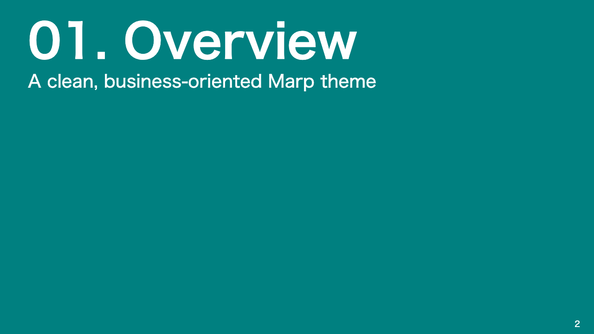
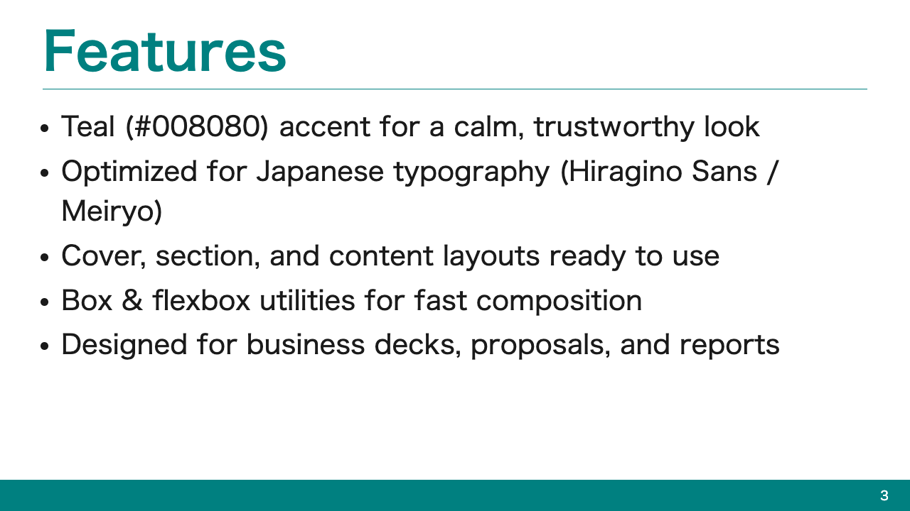
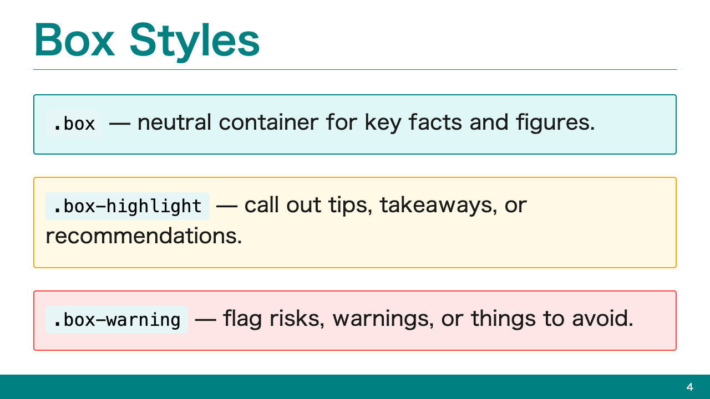
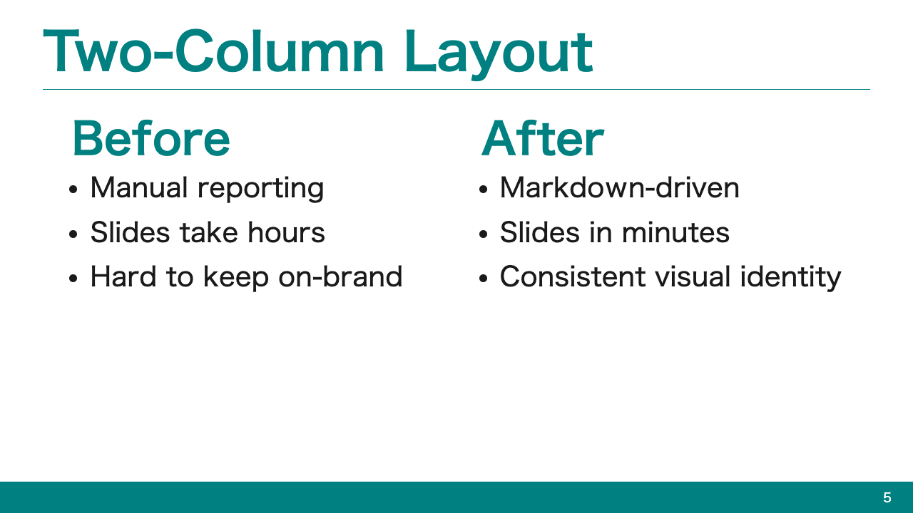
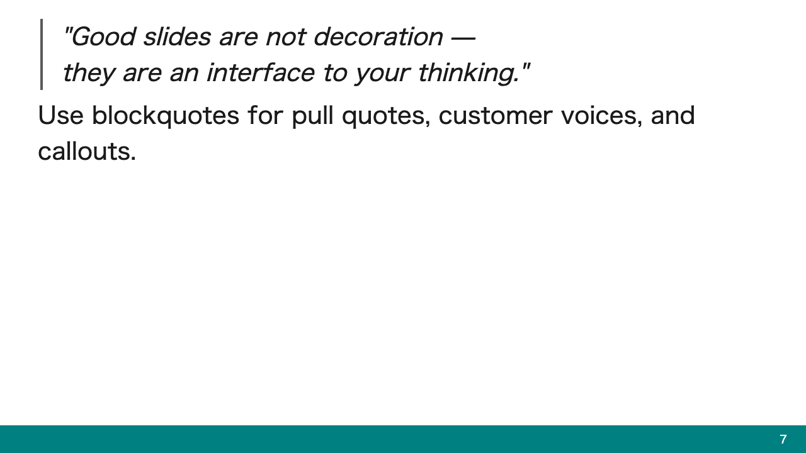

# Marp Theme Umino Biz

ビジネス用途のスライドにおすすめの、ティールカラーを基調としたクリーンな [Marp](https://marp.app/) テーマです。提案資料・社内報告・勉強会・商品紹介など、信頼感と読みやすさを両立したいシーンに向いています。

## プレビュー

| カバーページ | セクション区切り | コンテンツ |
|---|---|---|
|  |  |  |

| ボックススタイル | 2カラムレイアウト | 引用ブロック |
|---|---|---|
|  |  |  |

## 特徴

- ティール (#008080) をアクセントカラーに使用した落ち着いたビジネス向けデザイン
- 日本語フォント最適化（Hiragino Sans / Meiryo）
- カバーページ・セクション区切り・コンテンツの3レイアウトが揃っている
- 情報整理に使えるボックス3種: `.box`, `.box-highlight`, `.box-warning`
- Flexbox 2カラム、画像+テキストの組み合わせなどビジネス資料の定番レイアウトをサポート
- ページ番号・フッター・ヘッダーが自動でブランドカラーに揃う

## インストール

### Marp CLI

```bash
marp --theme-set umino-biz.css slide.md
```

### VS Code（Marp for VS Code）

1. `umino-biz.css` をプロジェクトにコピー
2. `.vscode/settings.json` に以下を追加:

```json
{
  "markdown.marp.themes": ["./umino-biz.css"]
}
```

3. Markdownファイルのフロントマターで `theme: umino-biz` を指定

### Obsidian（Marp Slides プラグイン）

[Marp Slides](https://github.com/samuele-cozzi/obsidian-marp-slides) プラグインを使っている場合:

1. Vault内にテーマ用フォルダを作成（例: `Themes/Marp/`）
2. `umino-biz.css` をそのフォルダにコピー
3. Obsidianの設定 → Marp Slides → **Theme Path** にフォルダパスを入力

```
Themes/Marp
```

4. Markdownファイルのフロントマターで指定:

```yaml
---
marp: true
theme: umino-biz
---
```

5. コマンドパレットから「Marp Slides: Preview」でプレビュー確認

> **補足:** Theme Path はVaultルートからの相対パスです。`umino-biz.css` の先頭行 `/* @theme umino-biz */` がテーマ名になります。

### PNG書き出し（CLI）

```bash
marp --no-stdin --html --theme-set umino-biz.css --images png --allow-local-files --output "./slide.png" "スライド.md"
```

## 使い方

### 基本構成

```markdown
---
marp: true
theme: umino-biz
paginate: true
---

# プレゼンテーションタイトル<!--fit-->
<!-- _class: cover-page -->

---

## コンテンツスライド

- ポイント1
- ポイント2
- ポイント3
```

### カバーページ

スライドに `<!-- _class: cover-page -->` を追加すると、背景がティールに塗りつぶされ、白文字でタイトルが中央に表示されます。プレゼンの表紙やタイトルスライドに最適です。

```markdown
# プレゼンテーションタイトル<!--fit-->
<!-- _class: cover-page -->
```

### セクション区切り

`<!-- _class: section -->` を使うと、章のはじまりを示すセクションスライドを作れます。背景がティールに塗りつぶされ、左上にタイトルとサブタイトルが配置されます。

```markdown
<!-- _class: section -->

# 01. Overview

セクションの要約や狙いを書く
```

### ボックススタイル

情報の種類に応じて3つのボックスを使い分けられます。

```html
<div class="box">
重要な情報やポイントの強調に
</div>

<div class="box-highlight">
ヒントやおすすめ情報に
</div>

<div class="box-warning">
注意事項や警告に
</div>
```

### Flexboxレイアウト（2カラム）

```html
<div class="flex sa">
<div>

左カラムの内容

</div>
<div>

右カラムの内容

</div>
</div>
```

| クラス | 説明 |
|--------|------|
| `.flex` | Flexboxを有効化 |
| `.sa` | `space-around` で均等配置 |
| `.sb` | `space-between` で両端配置 |
| `.fw` | `flex: var(--fw)` で等幅カラム |

### タイトルの自動フィット

長いタイトルには `<!--fit-->` を使うと、スライド幅に合わせてサイズが自動調整されます。

```markdown
# 長いタイトルもフィットします<!--fit-->
```

## カラーパレット

| 用途 | 色 |
|------|-----|
| アクセント（見出し・フッター・カバー） | `#008080` (Teal) |
| ボックス背景 | `#E0F7F7` |
| ハイライトボーダー | `#FFA500` |
| 警告ボーダー | `#FF4444` |
| メインテキスト | `#434343` |

## サンプル

`example.md` にこのテーマのすべての主要機能を使ったサンプルスライドが入っています。
ローカルで確認するには:

```bash
marp --preview example.md
```

## ライセンス

MIT
