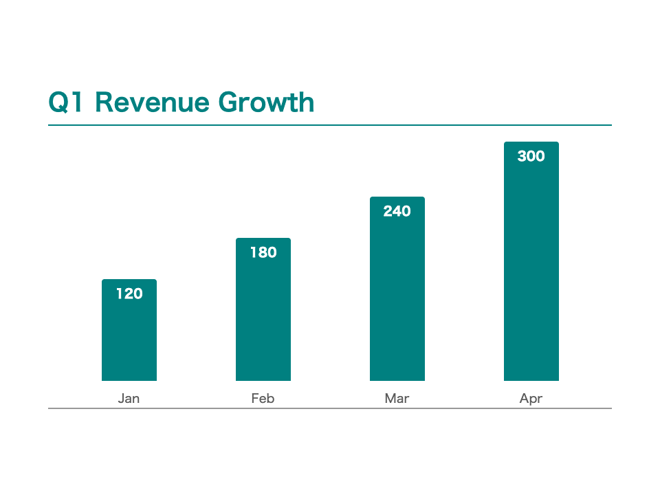

<!-- _paginate: false -->
<!-- _footer: "" -->

# Marpテーマ<br>Umino Biz<!--fit-->
ウミノ

<!-- _class: section -->

---

## 特徴
<br>

- ティール（#008080）をアクセントにした落ち着いた配色
- 日本語タイポグラフィ（ヒラギノ角ゴ／メイリオ）に最適化
- カバー・セクション・ヒーロー・コンテンツの各レイアウトに対応
- ボックスとフレックスのユーティリティでサクッと構成
- ビジネス資料・提案書・レポート向け

---

## ボックススタイル
<br>

<div class="box">

`.box` — 数値やファクトをまとめる基本の箱

</div>

<div class="box-highlight">

`.box-highlight` — ポイントやおすすめを強調する

</div>

<div class="box-warning">

`.box-warning` — リスクや注意点を目立たせる

</div>

---

## 2カラムレイアウト
<br>

<div class="flex sa">
<div>

### Before

- 手作業でレポート作成
- スライドに何時間もかかる
- ブランドの統一が難しい

</div>
<div>

### After

- Markdownで書くだけ
- スライドを数分で作成
- ビジュアルが常に統一

</div>
</div>

---

## 番号付きリスト

<br>

1) イントロダクション
2) セットアップ：拡張機能とテーマの適用
3) 基本：Marp構文のエッセンス
4) 応用：AIでテーマを作って書き出す
5) まとめ：AIと一緒にライブデモ

---

## テーブル
<br>

| 機能 | 対応 |
|---|---|
| カバースライド | `_class: section` またはH1自動 |
| ページ番号 | `paginate: true` |
| フッター／ヘッダー | `footer:` / `header:` ディレクティブ |
| カスタムボックス | `.box` `.box-highlight` `.box-warning` |
| フレックスレイアウト | `.flex .sa` `.flex .sb` |

---

<!-- _class: table-custom -->

## カスタムテーブル
<br>

| 機能 | 対応 |
|---|---|
| カバースライド | `_class: section` またはH1自動 |
| ページ番号 | `paginate: true` |
| フッター／ヘッダー | `footer:` / `header:` ディレクティブ |
| カスタムボックス | `.box` `.box-highlight` `.box-warning` |

---

## 引用ブロック
<br>

> 良いスライドは装飾ではなく
> あなたの思考に触れるためのインターフェース。

<br>

引用はプルクオート、お客様の声、コールアウトに使います。

---

## コードブロック
<br>

```yaml
---
marp: true
theme: umino-biz
paginate: true
---
```
<br>

```bash
marp --theme-set umino-biz.css slide.md
```

---

## テキストカラーヘルパー

`_class` でスライドごとに文字色を切り替えられます。

- `all-text-blue` — 全テキストを青に
- `all-text-red` — 全テキストを赤に
- `h2-text-red` — H2だけ赤に
- `text-center` — 段落を中央揃えに

---

## スクリーンショットスタイル
<br>

`screenshot` クラスで枠線と影つきの見た目に。

<br>



---

<!-- _paginate: false -->
<!-- _footer: "" -->

# ありがとうございました

<!-- _class: cover -->
